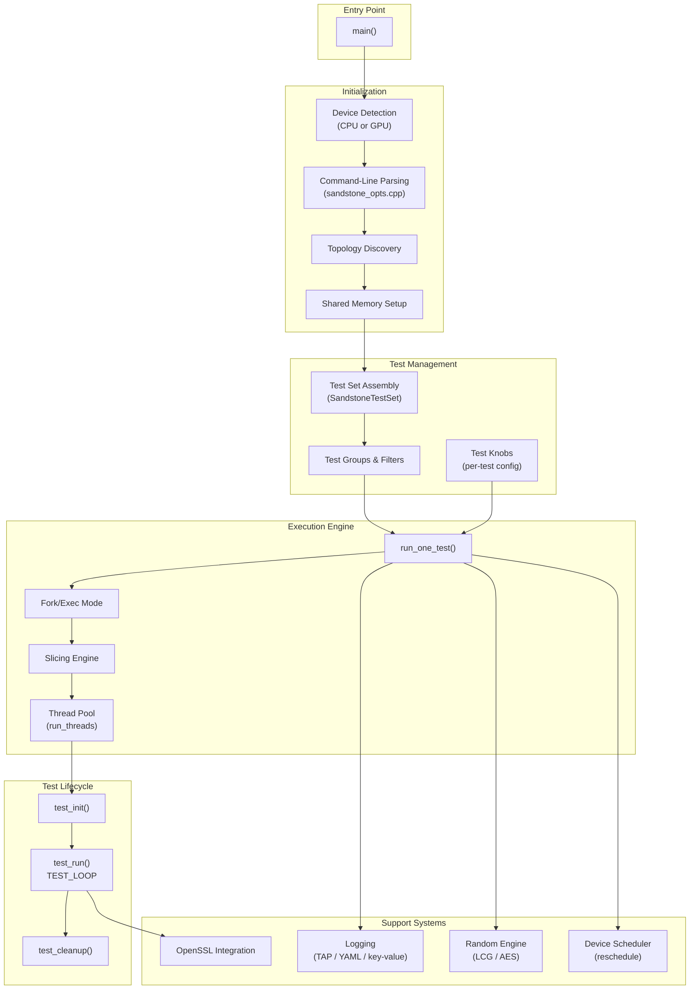
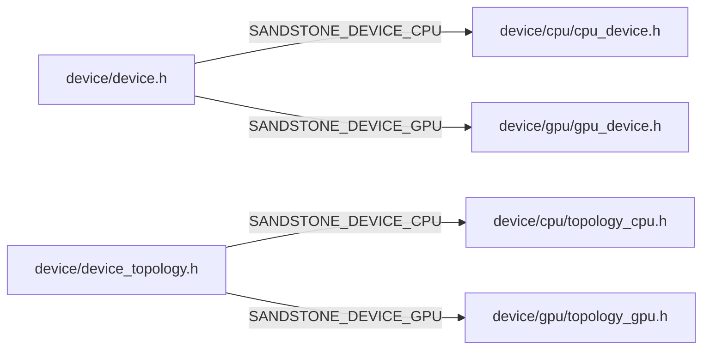
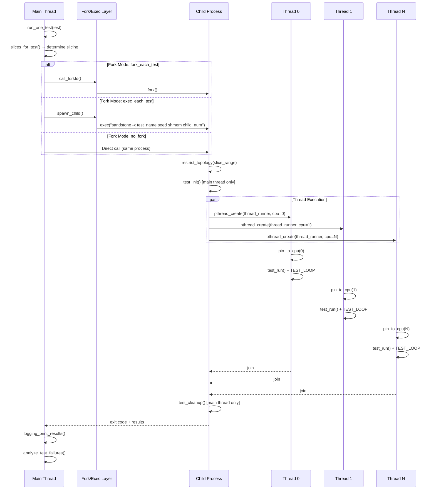
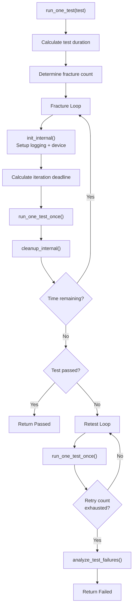
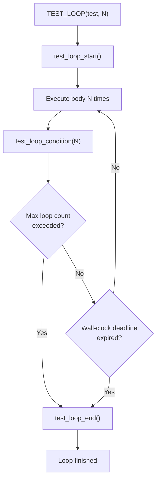
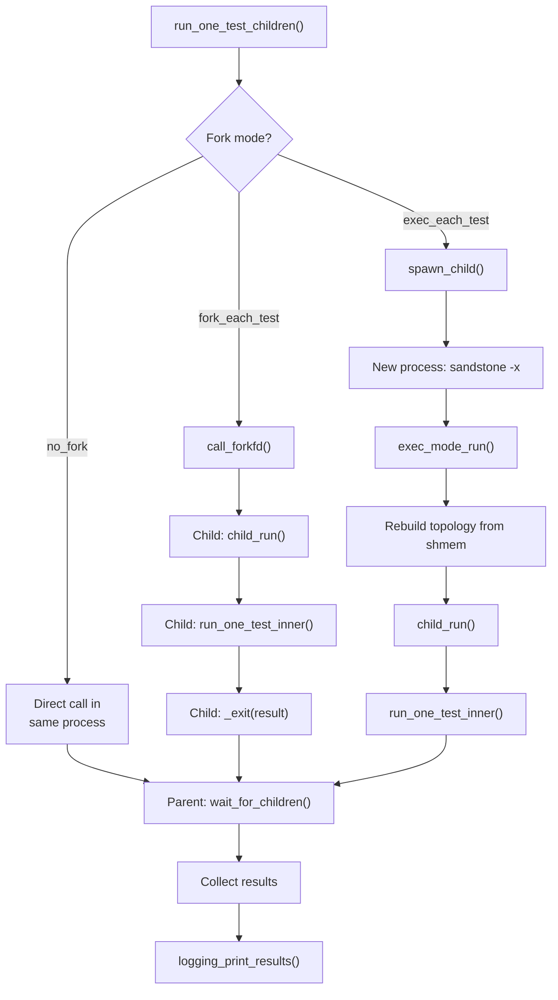
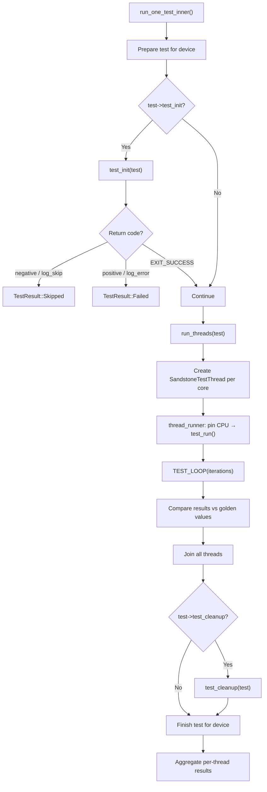

# OpenDCDiag — Developer Manual

> **Audience:** Developers, contributors, and AI agents working on the OpenDCDiag tool (built on the Sandstone framework).
>
> **Scope:** This manual covers the framework located in `opendcdiag/framework/`. It explains the
> execution flow from `main()`, directory organization, file descriptions, and all command-line
> options. Two execution models are documented: **CPU** and **GPU**.
>
> **AI Agent Context:** This document is designed to serve as contextual reference for AI coding
> assistants. When modifying, reviewing, or generating code in this project, use this manual to
> understand the architecture, data flow, control flow, and conventions.

---

## Table of Contents

1. [Architecture Overview](#1-architecture-overview)
2. [File Reference](#2-file-reference)
3. [CPU Execution Flow](#3-cpu-execution-flow)
4. [Test Execution Deep Dive](#4-test-execution-deep-dive)
5. [Command-Line Options Reference](#5-command-line-options-reference)
6. [Key Data Structures](#6-key-data-structures)
7. [Build Configuration](#7-build-configuration)
8. [AI Agent Guidelines](#8-ai-agent-guidelines)

---

## 1. Architecture Overview

OpenDCDiag is a hardware validation framework that detects Silent Data Errors (SDEs) by running
stress tests on Intel CPUs and GPUs. It operates at the OS level on Linux and Windows.

### Design Principles

- Tests do **not** check instruction correctness — they check **consistency** of results.
- Tests are designed to trick hardware into producing unexpected behaviors.
- Tests run in very short time frames (typically milliseconds).

### High-Level Components



### Device Abstraction

The framework uses compile-time device selection via `SANDSTONE_DEVICE_CPU` or
`SANDSTONE_DEVICE_GPU` flags. Header files in `device/` conditionally include the appropriate
device-specific implementation:



---

## 2. File Reference

### Core Framework Files

| File | Purpose |
|------|---------|
| `sandstone.cpp` | Main entry point (`main()`), test orchestration (`run_one_test()`), fork/exec management, thread coordination, and the main execution loop. |
| `sandstone.h` | Public API header. Defines `TEST_LOOP`, `DECLARE_TEST`, logging macros (`log_error`, `log_warning`, `log_info`), test quality levels, and skip categories. This is the primary header tests include. |
| `sandstone_p.h` | Private/internal header. Contains `SandstoneApplication` config, `TestResult` enum, memory-mapping utilities, `FrequencyManager`, and device-specific init declarations. Not for test code. |
| `sandstone_opts.cpp` | Full command-line argument parsing using `getopt_long`. Defines all `--long-options`, collects, validates, and applies them to `SandstoneApplication` and `ProgramOptions`. |
| `sandstone_opts.hpp` | Declares `ProgramOptions` struct and `Action` enum used by the options parser. |
| `sandstone_config.h.in` | Meson template generating `sandstone_config.h`. Defines compile-time booleans: `SANDSTONE_SSL_BUILD`, `SANDSTONE_DEVICE_CPU`, `SANDSTONE_DEVICE_GPU`, `SandstoneConfig::NoLogging`, etc. |

### Thread & Process Management

| File | Purpose |
|------|---------|
| `sandstone_thread.cpp/.h` | `SandstoneTestThread` class managing thread creation with pre-guarded stacks, start/join lifecycle, and stack overflow detection. |
| `sandstone_sections.S` | Assembly file defining ELF/Mach-O section symbols (`__start_tests`, `__stop_tests`) for automatic test registration across compilation units. |

### Test System

| File | Purpose |
|------|---------|
| `sandstone_tests.cpp/.h` | `SandstoneTestSet` class for test collection management. Handles add/remove by name or wildcard, quality filtering, randomization, group membership, and built-in test lists. |
| `sandstone_test_groups.cpp/.h` | Defines test group structures (`group_compression`, `group_math`, `group_fuzzing`, `group_kvm`). Groups enable batch operations on related tests. |
| `test_knobs.cpp/.h` | Per-test key-value parameter system. Tests read knobs via `get_test_knob_value_uint()` etc. Set via `--test-option KNOB=VALUE` on the command line. |
| `sandstone_test_utils.h` | `ManagedCodeBuffer` for allocating executable memory pages used by JIT/Xbyak tests. |
| `test_data.h` | Per-thread execution state: `ThreadState` enum, loop counters, log message counts, timing data, and failure flags. |
| `selftest.cpp` | Framework self-validation tests verifying data types, threading, test system, and exception handling. |

### Data Types

| File | Purpose |
|------|---------|
| `sandstone_data.cpp/.h` | Numeric type definitions (`UInt8`..`UInt128`, `Int8`..`Int64`, `Float16`, `BFloat16`, `Float32`, `Float64`, `Float80`, `Float128`) with conversion and formatting. |
| `Floats.cpp` | Implementations for special float types including BFloat8, HFloat8, and their conversion routines. |
| `fp_vectors/Floats.h` | Float type headers with bit-field manipulation for IEEE-754 representations. |
| `static_vectors.c` | Pre-computed test vectors (walk patterns, march patterns) for FPU stress testing. |
| `generated_vectors.c` | Auto-generated float vectors for edge-case FPU testing. |

### Logging

| File | Purpose |
|------|---------|
| `logging.cpp/.h` | Core logging system with `AbstractLogger` base class. Supports TAP, YAML, and key-value output formats. Manages per-thread log files, binary message iteration via `LogMessagesFile`, and result aggregation. |
| `device/cpu/logging_cpu.cpp/.h` | CPU-specific logging: per-thread topology info (package, core, thread), microcode, PPIN, frequency. |
| `device/gpu/logging_gpu.cpp` | GPU-specific logging: GPU number, UUID, PCI address, architecture name. |

### Random Number Generation

| File | Purpose |
|------|---------|
| `random.cpp` | Multi-engine RNG supporting LCG and AES-based generators. Per-thread state management, global seeding, and state serialization for reproducibility. |

### Cryptography

| File | Purpose |
|------|---------|
| `sandstone_ssl.cpp/.h` | OpenSSL wrapper with dynamic function loading. Provides AES, SHA, MD5, RSA, HMAC, BIO, EVP operations. Can link statically or load `libssl`/`libcrypto` at runtime. |
| `sandstone_ssl_rand.cpp/.h` | Integrates the framework's RNG as an OpenSSL RAND provider. |

### Time & Chrono

| File | Purpose |
|------|---------|
| `sandstone_chrono.cpp/.h` | Time utilities: `ShortDuration`, `MonotonicTimePoint`, coarse clock, and `string_to_millisecs()` for parsing duration strings like `"200ms"`, `"5s"`, `"2m"`. |

### System & Platform

| File | Purpose |
|------|---------|
| `sandstone_utils.cpp/.h` | RAII wrappers (`auto_fd`, `AutoClosingFile`) and data formatting utilities. |
| `sandstone_iovec.h` | Template helpers for vectored I/O (`writevec`, `writeln`). |
| `sandstone_system.h` | System-level abstractions for cross-platform compatibility. |
| `sandstone_virt.h` | VM and container detection (`detect_running_container()`, `detect_running_vm()`). |
| `sandstone_asm.h` | Macros for defining inline assembly functions with custom ELF sections. |
| `mmap_region.c` | File memory-mapping utility (`mmap_file()`, `munmap_file()`). |

### Debugging & Diagnostics

| File | Purpose |
|------|---------|
| `sandstone_context_dump.cpp/.h` | Dumps CPU register context (GPRs and XSAVE state) on crashes. Platform-abstracted machine context. |
| `sandstone_child_debug_common.h` | Calculates XSAVE area sizes from CPU feature bits for core dump analysis. |
| `interrupt_monitor.hpp` | Monitors MCE (Machine Check Exception) and thermal interrupts via MSR reads. Linux x86-64 specific. |
| `xsave_states.h` | Enumerates XSAVE component states (X87, SSE, AVX, AVX-512, AMX, APX). |

### Virtualization

| File | Purpose |
|------|---------|
| `sandstone_kvm.h` | KVM test infrastructure with per-thread VM context (`kvm_ctx`), VM configuration (`kvm_config`), and exit handlers. |

### Topology

| File | Purpose |
|------|---------|
| `topology.h` | Core topology abstractions: `LogicalProcessor`, `LogicalProcessorSet`, `DeviceRange`, `SlicePlans`, and scheduler mode enums (`RescheduleMode`). |

### Fuzzing

| File | Purpose |
|------|---------|
| `fuzzing.c` | AFL++ fuzzing harness entry points for `memset_random()` and `memcmp_or_fail()`. |

### Fork Management

| File | Purpose |
|------|---------|
| `forkfd/forkfd.c/.h` | Portable fork-with-notification library. Returns a file descriptor that becomes readable when the child exits. |
| `forkfd/forkfd_linux.c` | Linux `pidfd` / `clone()` implementation of forkfd. |
| `forkfd/forkfd_freebsd.c` | FreeBSD `pdfork()` implementation of forkfd. |

---

## 3. CPU Execution Flow

### CPU Thread Execution Model



### CPU vs GPU Execution Comparison

| Aspect | CPU Build | GPU Build |
|--------|-----------|-----------|
| **Detection** | CPUID instructions | Level Zero driver API |
| **Topology** | Package → Core → Thread hierarchy | Device → Subdevice (tile) hierarchy |
| **Thread target** | Each thread runs on a logical CPU | Each thread targets a GPU + NUMA-local CPU |
| **Memory model** | Virtual addressing (shared) | Explicit device/host memory allocation |
| **Synchronization** | pthread barriers | Level Zero queues + fences |
| **Feature detection** | CPU feature bitmask | `gpu_arch_t` (GMD architecture ID) |
| **Scheduling** | Barrier/Queue/Random rescheduling | Single slice (all GPUs as one group) |
| **Temperature** | MSR-based readings | Sysman `zesTemperatureGetState()` |
| **Affinity** | Direct CPU pinning | GPU assigned to NUMA-local CPU |

---

## 4. Test Execution Deep Dive

### run_one_test() — Orchestrating a Single Test



### The `TEST_LOOP` Macro

`TEST_LOOP` is the core iteration primitive used inside every test's `test_run` function. It
executes the loop body repeatedly until the framework signals that the test's time slot has
elapsed.

#### Signature

```c
TEST_LOOP(test, N) {
    // loop body
}
```

- **`test`** — the `struct test *` pointer received by `test_run`.
- **`N`** — the *granularity* of the loop. The body executes **N** times before the framework
  checks whether the time slot is still active. By convention `N` is always a **power of two**.

#### How It Works

`TEST_LOOP` expands into a nested `for`-loop structure:

1. **`test_loop_start()`** — called once at entry. Records the loop start time and emits an
   assembly marker (used by profiling tools such as Intel SDE/PIN).
2. **Inner loop** — executes the body `N` times without any check.
3. **`test_loop_condition(N)`** — called after each batch of `N` iterations. It:
   - Injects idle time if `--inject-idle` is configured (sleeps `idle_duration / N` per batch).
   - Increments `inner_loop_count` on the per-thread data.
   - Checks `current_max_loop_count`; if exceeded, the loop ends.
   - Checks the wall-clock deadline (`current_test_endtime`); if expired, the loop ends.
4. **`test_loop_end()`** — called once on exit. Emits the end assembly marker with the final
   iteration count.



#### Interaction with Fracturing

Each fracture iteration sets a new `current_max_loop_count` and `current_test_endtime`. When a
fracture completes, the RNG is re-seeded and a new `TEST_LOOP` execution begins in the next
fracture cycle. The `inner_loop_count` is tracked per-thread for diagnostics and controls when
the loop terminates.

#### Alternative: `test_time_condition()`

Tests that cannot use the `TEST_LOOP` macro (e.g. tests with custom looping structures) can call
`test_time_condition()` directly. It returns `true` while time remains in the test's slot.

### Fracturing Mechanism

Tests can run multiple time within a single invocation, a technique called `fracturing`.
Each `fracture`, resets the random data generated during initialization, runs for 200–400
milliseconds, and then restarts to re-seed the random number generator (RNG). This lets a test
run multiple times in one invocation, ensuring fresh random data is used each time and
increasing test coverage.


- **Auto-fracture**: Starts with 40 iterations, doubles on each fracture cycle during an initial
                     10ms ramp-up window.
- **Configured fracture**: Uses `fracture_loop_count` to change the number of iterations per
                           fracture cycle. `<0` means no fracture (run once), `0` means default
                           behavior, and `>0` means fixed iterations per cycle.
- **Duration-limited**: Repeats until `sApp->current_test_duration` is exceeded.

Each fracture iteration re-seeds the RNG with an advanced state.

### Slicing

To parallelize test execution, systems with a high core count divide available CPU cores into
groups known as `slices`. Each slice runs its own main thread, which is a replica of the original
process. These slices operate concurrently, with each child process isolated to its slice
(maintaining an independent address space). Slices are confined to cores within the same NUMA
domain, ensuring efficient memory access and performance.

#### Slicing Modes

| Mode                | Flag                         | Description                                              | Typical Use Case                                             |
|---------------------|------------------------------|----------------------------------------------------------|--------------------------------------------------------------|
| **Heuristic** (default)    | `test_schedule_default`       | Cores are divided into balanced slices for maximum parallelism.         | Suitable for most test scenarios                             |
| **Isolate Socket**         | `test_schedule_isolate_socket`| One slice is assigned per CPU socket.                    | Tests accessing off-core resources (e.g., accelerators, LLC/L3 cache) |
| **Full System**            | `test_schedule_fullsystem`    | No slicing; tests run with a full system view.           | Tests involving cross-socket communication                    |
| **Sequential**             | `test_schedule_sequential`    | Tests run sequentially across the full system.           | Tests that must execute serially (e.g., In-Field Scan)        |
| **Isolate NUMA**           | `test_schedule_isolate_numa`  | One slice per NUMA domain.                               | Tests accessing NUMA-local resources (e.g., memory)           |

### Fork Mode Execution



### Test Lifecycle in Detail



### Retest and Failure Analysis

When a test fails, the framework retests to distinguish hardware faults from software bugs:

1. Retest up to `retest_count` times (default: 10)
2. Track per-thread failure bitmask across retests
3. Analyze failure patterns:
   - **All threads fail identically** → likely a software bug
   - **Specific cores fail consistently** → potential hardware fault
   - **Random failures** → intermittent hardware issue
4. `analyze_test_failures_for_topology()` maps failures to physical topology

---

## 5. Command-Line Options Reference

### Execution Duration

| Option | Description |
|--------|-------------|
| `-T <time>`, `--total-time=<time>` | Minimum total run time. Accepts `ms`, `s`, `m`, `h` suffixes. Use `"forever"` for infinite loop. Enables cycle-through mode. |
| `--1sec` | Run for 1 second with randomized test order and strict runtime. |
| `--30sec` | Run for 30 seconds with randomized test order and strict runtime. |
| `--2min` | Run for 2 minutes with randomized test order and strict runtime. |
| `--5min` | Run for 5 minutes with randomized test order and strict runtime. |
| `-t <time>`, `--test-time=<time>` | Per-test execution time. Accepts `ms`, `s`, `m`, `h` suffixes. Default unit is milliseconds. |
| `--force-test-time` | Override per-test min/max duration constraints specified by the test. |
| `--strict-runtime` | Use with `-T` to force the program to stop execution after the specified time. |
| `--test-delay <time>` | Delay between individual test executions (milliseconds). |

### Test Selection

| Option | Description |
|--------|-------------|
| `-e <test>`, `--enable=<test>` | Enable a specific test by ID, wildcard pattern, or group (prefix `@`). Repeatable. |
| `--disable=<test>` | Disable a specific test by ID, wildcard, or group. Repeatable. |
| `--test-list-file <path>` | Load test list from a text file. Supports per-test duration overrides. |
| `--use-builtin-test-list[=name]` | Use a built-in test list. Optional name parameter; defaults to `"auto"`. |
| `--test-list-randomize` | Randomize the order in which tests execute. |
| `--max-test-count <N>` | Limit total number of tests executed per invocation. |

### Test Execution Control

| Option | Description |
|--------|-------------|
| `--max-test-loop-count <N>` | Maximum iterations of `TEST_LOOP` per test. Value of `0` means unlimited. Disables test fracturing. |
| `--quick` | Run each test once with a single loop iteration. Disables fractured execution and test delay. |
| `-n <N>`, `--threads=<N>` | Set number of test threads. Defaults to number of CPUs. `0` = all CPUs. |
| `-f <mode>`, `--fork-mode=<mode>` | Process isolation mode: `no` (no fork), `exec` (exec each test), `yes`/`each-test` (fork each test, Unix only). |
| `--cpuset=<set>`, `--deviceset=<set>` | Select CPUs/GPUs to test. Comma-separated list of logical IDs or topology selectors (`p`=package, `c`=core, `t`=thread, `g`=GPU). |
| `-O <KNOB=VALUE>`, `--test-option=<KNOB=VALUE>` | Set a test-specific knob value. Repeatable. |
| `--timeout <time>` | Maximum time a single test can run before being killed. |
| `--timeout-kill <time>` | Grace period after timeout before force-killing a test. |

### Slicing and Scheduling

| Option | Description |
|--------|-------------|
| `--max-cores-per-slice <N>` | Maximum cores assigned to each test slice. Use `-1` to disable slicing. |
| `--no-slicing` | Disable test slicing entirely (all cores in one slice). |
| `--reschedule <mode>` | Thread rescheduling strategy: `none`, `queue` (round-robin), `barrier` (experimental: barrier-synced rotation), `random` (experimental: random assignment). |

### Failure Handling

| Option | Description |
|--------|-------------|
| `-F`, `--fatal-errors` | Stop execution after the first test failure. |
| `--fatal-skips` | Stop execution if a test is skipped. |
| `--retest-on-failure <N>` | Number of retests when a test fails. Default: 10. Max: 64. |
| `--total-retest-on-failure <N>` | Total retest budget across all tests. `-1` = unlimited. Default: 10× retest count. |
| `--ignore-os-errors`, `--ignore-timeout` | Continue execution even if a test encounters OS errors or timeouts. |
| `--ignore-mce-errors` | Ignore Machine Check Exception errors. |
| `--ud-on-failure` | Execute UD2 instruction on test failure (triggers SIGILL for debugging). |
| `--on-crash <command>` | Command to execute when a test crashes. |
| `--on-hang <command>` | Command to execute when a test hangs. |

### Output and Logging

| Option | Description |
|--------|-------------|
| `-v`, `--verbose` | Increase verbosity level. Repeatable (up to max verbosity). |
| `-q`, `--quiet` | Set verbosity to quiet (minimal output). |
| `-o <file>`, `--output-log=<file>` | Write log output to file. Use `/dev/null` to suppress file output. |
| `-Y[indent]`, `--yaml[=indent]` | Use YAML format for log output. Optional indent value. |
| `--output-format <fmt>` | Set output format: `tap` (default), `yaml`, `key-value`. |
| `--max-messages <N>` | Max log messages per thread per test. Default: 5. `0` = unlimited. |
| `--max-logdata <N>` | Max bytes of binary data logged per thread per test. Default: 128. `0` = unlimited. |
| `--syslog` | Send logging output to syslog. |

### Quality and Filtering

| Option | Description |
|--------|-------------|
| `--quality <N>` | Set minimum test quality level. Tests below this level are skipped. |
| `--alpha` | Include alpha-quality tests (equivalent to `--quality` with skip level). |
| `--beta` | Include beta-quality tests. |
| `--include-optional` | Include tests marked as optional. |
| `--ignore-unknown-tests` | Don't error out on unknown test names in `--enable`, `--disable`, or test list files. |

### Information and Diagnostics

| Option | Description |
|--------|-------------|
| `-l`, `--list` | List all tests and groups with descriptions, then exit. |
| `--list-tests` | List test names only, then exit. |
| `--list-groups` | List test group names only, then exit. |
| `--list-group-members <group>` | List tests in a specific group, then exit. |
| `--dump-cpu-info`, `--dump-device-info` | Print detected CPU/GPU topology information, then exit. |
| `--version` | Print version info, then exit. |
| `-h`, `--help` | Print usage help, then exit. |

### Random State

| Option | Description |
|--------|-------------|
| `-s <state>`, `--rng-state=<state>` | Reload RNG state for reproducibility. Format: `Engine:engine-specific-data`. |

### Service Mode

| Option | Description |
|--------|-------------|
| `--service` | Run as a slow background scan service. Enables fatal-errors and infinite runtime. Uses background scan idle waits between tests. |

### Hardware-Specific

| Option | Description |
|--------|-------------|
| `--temperature-threshold <N>` | Temperature threshold in thousandths of degrees Celsius (e.g., `85000` = 85°C). Use `"disable"` to disable monitoring. |
| `--inject-idle <N>` | Inject idle percentage (0-50) into test execution for thermal management. |
| `--vary-frequency` | (Linux only) Vary CPU core frequency during execution. Requires frequency manager support. |
| `--vary-uncore-frequency` | (Linux only) Vary uncore frequency during execution. Requires frequency manager support. |

### Debug-Only Options

These options are only available in debug builds (`!NDEBUG`):

| Option | Description |
|--------|-------------|
| `--gdb-server <comm>` | Start GDB server with specified communication channel. |
| `--test-tests` | Enable test-testing mode (validates test behavior). |
| `--is-debug-build` | Report that this is a debug build and exit. |
| `--is-asan-build` | Report that this is an ASAN build and exit. (Only with `__SANITIZE_ADDRESS__`.) |

### Self-Test

| Option | Description |
|--------|-------------|
| `--selftests` | Run framework self-validation tests. Only available when `NO_SELF_TESTS` is not defined. |

### Deprecated Options (Ignored)

The following options are accepted but produce a deprecation warning and have no effect:

- `--longer-runtime`
- `--max-concurrent-threads`
- `--mem-sample-time`
- `--mem-samples-per-log`
- `--no-memory-sampling`
- `--no-triage` / `--triage`
- `--schedule-by`
- `--shorten-runtime`
- `--weighted-testrun-type`

---

## 6. Key Data Structures

### SandstoneApplication (sandstone_p.h)

Central application state singleton. Key fields:

```
SandstoneApplication {
    fork_mode             // ForkMode enum (no_fork, fork_each_test, exec_each_test)
    thread_count          // Total number of test threads
    shmem                 // Shared memory segment (SharedMemoryConfig)
    test_time             // Per-test duration
    max_test_time         // Per-test timeout
    endtime               // Program end time (MonotonicTimePoint)
    retest_count          // Retests per failure (default 10)
    total_retest_count    // Total retest budget
    max_test_count        // Max tests to run
    max_test_loop_count   // Max TEST_LOOP iterations
    slice_plans           // SlicePlans: heuristic or explicit slice ranges
    frequency_manager     // Optional CPU frequency controller
    requested_quality     // Minimum test quality level
    delay_between_tests   // Inter-test delay
    fatal_skips           // Stop on skip
    ignore_os_errors      // Continue on OS errors
    ignore_mce_errors     // Ignore MCE
    force_test_time       // Override test min/max duration
    service_background_scan // Service mode flag
}
```

### struct test (sandstone.h)

Test descriptor registered via `DECLARE_TEST`:

```
struct test {
    id                    // Test string identifier
    description           // Brief text description
    quality_level         // TEST_QUALITY_PROD, TEST_QUALITY_BETA, TEST_QUALITY_SKIP
    test_preinit          // Optional: runs once before any tests
    test_init             // Optional: runs before each test invocation (main thread)
    test_run              // Required: runs on each test thread
    test_cleanup          // Optional: runs after each test invocation (main thread)
    test_postcleanup      // Optional: runs once after all tests
    groups                // Array of test_group pointers
    minimum_cpu           // Required CPU feature bitmask
    flags                 // Scheduling flags (sequential, isolate_socket, etc.)
    fracture_loop_count   // Fracture iteration override
    data                  // User data pointer (set in init, read in run/cleanup)
}
```

### cpu_info_t (device/cpu/cpu_device.h)

Per-logical-processor CPU information:

```
cpu_info_t {
    cpu_number            // OS logical processor number
    thread_id             // 0 or 1 within core
    core_id               // Core number within package
    module_id             // Module/cluster within package
    tile_id               // Tile within package
    native_core_type      // P-core vs E-core
    numa_id               // NUMA node
    package_id            // Socket number
    hwid                  // APIC/x2APIC ID
    microcode             // Microcode version
    cache[3]              // L1/L2/L3 cache info
}
```

### gpu_info_t (device/gpu/gpu_device.h)

Per-GPU device information:

```
gpu_info_t {
    cpu_number            // Affinity: assigned logical CPU
    package_id            // NUMA package
    gpu_number            // Global GPU index (0..N-1)
    device_index          // Physical GPU index
    subdevice_index       // Tile index (-1 if single GPU)
    bdf                   // PCI Bus/Device/Function address
    gpu_arch              // Architecture ID (GMD)
    num_subdevices        // Number of tiles
    device_properties     // Level Zero device properties
    compute_properties    // Level Zero compute properties
}
```

### TestResult (sandstone_p.h)

```
enum TestResult {
    Passed,               // Test completed successfully
    Skipped,              // Test was skipped (missing features, etc.)
    Failed,               // Test detected data inconsistency
    CoreDumped,           // Test caused a core dump
    Killed,               // Test was killed by signal
    OperatingSystemError, // OS-level error during test
    TimedOut,             // Test exceeded timeout
    OutOfMemory           // Test ran out of memory
}
```

---

## 7. Build Configuration

### Compile-Time Flags (sandstone_config.h.in)

| Flag | Purpose |
|------|---------|
| `SANDSTONE_DEVICE_CPU` | Build for CPU testing |
| `SANDSTONE_DEVICE_GPU` | Build for GPU testing |
| `SANDSTONE_SSL_BUILD` | Enable OpenSSL integration |
| `SANDSTONE_SSL_LINKED` | OpenSSL is statically linked (vs. dynamically loaded) |
| `SANDSTONE_FREQUENCY_MANAGER` | Enable CPU frequency management |
| `SandstoneConfig::NoLogging` | Disable all logging |
| `SandstoneConfig::RestrictedCommandLine` | Use simplified CLI (service mode only) |
| `SandstoneConfig::HasBuiltinTestList` | Built-in test list is compiled in |
| `NO_SELF_TESTS` | Exclude self-test code |

### Build Commands

The project uses Meson as its build system:

```bash
# Standard CPU build
./build.sh

# APX-enabled build
./build.sh sandstone_apx
```

Build artifacts are placed in `builddir-sandstone/`, `builddir-dcdiag/`, etc.

---

## 8. AI Agent Guidelines

### When Modifying Framework Code

1. **Read `sandstone.h` first** — it contains the public API that tests depend on.
2. **Check `sandstone_p.h`** for internal structures before modifying `sandstone.cpp`.
3. **Device abstraction**: Code in `device/` is conditionally compiled. Changes must consider both CPU and GPU builds.
4. **OS abstraction**: `sysdeps/` contains per-OS implementations. Changes in one OS directory may need counterparts in others.
5. **Thread safety**: `sandstone.cpp` uses shared memory (`shmem`) across processes. Modifications to shared state require careful synchronization.

### When Writing New Tests

1. Follow the test template in the project's copilot-instructions.md.
2. Include `<sandstone.h>` — never `sandstone_p.h`.
3. Use `TEST_LOOP` for the inner loop — it handles timing and loop count limits.
4. Use `log_error`/`log_warning`/`log_info` for reporting, not `printf`.
5. Allocate test data in `test_init`, store in `test->data`, free in `test_cleanup`.
6. Declare minimum CPU features via `.minimum_cpu` in `DECLARE_TEST`.
7. Choose the appropriate `.quality_level` (`TEST_QUALITY_PROD`, `TEST_QUALITY_BETA`, `TEST_QUALITY_SKIP`).

### When Modifying CLI Options

1. Options are defined in `sandstone_opts.cpp` in three places:
   - The `enum` block for option IDs
   - The `long_options[]` array for `getopt_long`
   - The `usage()` function text
   - The `collect_args()` switch/case for collection
   - The `parse_args()` method for application
2. Follow the existing pattern: collect in `collect_args()`, validate in `validate_args()`, apply in `parse_args()`.
3. Add to the `usage()` help text to document the new option.
4. Add unit tests in `unit-tests/opts_parser_tests.cpp`.

### Key Conventions

- **C++11 preferred** for test code.
- **`snake_case`** for functions and variables.
- **`CamelCase`** for structs and classes.
- **`ALL_CAPS`** for macros and constants.
- **4-space indentation**, 100-character line limit.
- **`//` comments**, `/* */` for license blocks and test descriptions.
- **Opening brace `{` on new line** for function definitions.

### File Relationships Quick Reference

```
sandstone.h          ← Tests include this
    ↓
sandstone_p.h        ← Framework internals
    ↓
sandstone.cpp        ← main(), run_one_test(), thread management
    ↓
sandstone_opts.cpp   ← CLI parsing → ProgramOptions
    ↓
sandstone_tests.cpp  ← SandstoneTestSet management
    ↓
device/device.h      ← CPU or GPU (compile-time switch)
    ↓
device/cpu/ or device/gpu/  ← Device-specific implementation
```

### Debugging Tips

- Use `--fork-mode=no` to debug tests without forking (single-process GDB).
- Use `--gdb-server` (debug builds) for remote debugging of child processes.
- Use `--on-crash` and `--on-hang` to invoke external tools on failures.
- Use `-v -v -v` for maximum verbosity.
- Use `--yaml` for structured log output that can be parsed programmatically.
- Use `--rng-state` to reproduce a specific test run.
- Use `--quick` for fast iteration during development (single loop, no fracturing).
